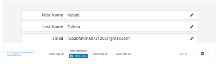

# AI Fluency – FL-01: Workflow Audit

> **Author:** Fatima Rubab  
> **Program:** Bachelor of Computer Science  
> **Focus Areas:** Backend Engineering • AI Engineering • Research  
> **Assignment:** FL-01 – AI Workflow Audit

---

# Overview

This repository contains my submission for **FL-01: AI Workflow Audit**.

The objective of this assignment was to analyze my real weekly workflow, determine where Artificial Intelligence can improve productivity, identify tasks that require human judgment, configure an AI workspace in Claude, and define three recurring workflows that will be refined throughout the AI Fluency program.

---

# Objectives

- Audit my real weekly workflow
- Classify recurring tasks using the AI collaboration framework
- Configure a dedicated Claude Project
- Define reusable workflows for future assignments
- Establish measurable success criteria for each workflow

---

# Workflow Audit

| # | Recurring Task | Classification | Rationale |
|---|----------------|---------------|-----------|
| 1 | Selecting and refining a research paper topic | Collaborate with AI | AI can identify potential research gaps and recommend relevant literature, while I make the final research decisions. |
| 2 | Writing a conference research paper from scratch | Collaborate with AI | AI assists with outlining, literature synthesis, editing, and formatting, while I maintain originality and technical accuracy. |
| 3 | Reading and understanding research papers | Delegate to AI with Review | AI summarizes and explains papers, but I verify findings by reviewing the original publications. |
| 4 | Data cleaning, preprocessing, and experimentation | Collaborate with AI | AI assists with implementation and methodology while I validate experiments and interpret results. |
| 5 | Studying Backend Engineering | Collaborate with AI | AI serves as a mentor by explaining concepts and reviewing understanding while I perform the actual learning. |
| 6 | Building Backend Projects | Collaborate with AI | AI assists with architecture, debugging, and best practices while I design and implement the system. |
| 7 | Debugging development environments | Delegate to AI with Review | AI accelerates troubleshooting while I verify each solution before applying it. |
| 8 | Internship deliverables | Collaborate with AI | AI improves productivity through brainstorming and review while I remain responsible for the final work. |
| 9 | University coursework | Collaborate with AI | AI explains concepts and provides guidance while I solve and verify the work independently. |
| 10 | Weekly planning and prioritization | Delegate to AI with Review | AI helps organize priorities while I adjust plans according to deadlines and commitments. |
| 11 | Career decisions | **Just Me** | These decisions depend on my personal goals, interests, and long-term vision. |
| 12 | Academic integrity and research originality | **Just Me** | I am responsible for ensuring my work is ethical, original, and accurately represents my own research. |

---

# Claude Project Configuration

## Project Purpose

I created a dedicated Claude Project that acts as my long-term research mentor. Rather than generating research on my behalf, the project is configured to guide me through the complete research lifecycle while helping me develop independent research skills.

### Project Focus

- Research Methodology
- Scientific Writing
- Literature Review
- AI & Machine Learning Research
- Cybersecurity Research
- Conference Paper Development

---

## Custom Instructions

The Claude Project was configured to:

- Act as an experienced Research Advisor and Mentor.
- Teach from first principles.
- Guide the complete research lifecycle.
- Emphasize scientific rigor and reproducibility.
- Encourage critical thinking instead of providing direct answers.
- Prioritize academic integrity and ethical AI usage.

---

## Research Mentor Prompt

The project uses a dedicated research prompt that instructs Claude to:

- Guide research step-by-step.
- Help identify research gaps.
- Design rigorous experiments.
- Recommend datasets and evaluation metrics.
- Review scientific writing.
- Explain research decisions and trade-offs.
- Develop independent research skills instead of simply producing answers.

---

# Just Me Tasks

## 1. Making Final Research Decisions

Although AI can recommend ideas and provide analysis, I remain responsible for selecting the research problem, evaluating recommendations, and making scientific decisions throughout the research process.

## 2. Maintaining Academic Integrity

Ensuring originality, ethical conduct, proper citation, and accurate reporting of research findings is my personal responsibility and cannot be delegated to AI.

---

# Target Task 1: Writing a Conference Research Paper

## Success Definition

A research paper is considered complete when it:

- Defines a clear research problem.
- States explicit research objectives and questions.
- Justifies the selected dataset.
- Documents preprocessing.
- Implements and evaluates the required ML/DL models.
- Uses appropriate evaluation metrics.
- Presents evidence-based analysis.
- Includes a literature review supported by credible academic sources.
- Follows IEEE conference formatting.
- Is technically accurate, original, and ready for submission.

---

# Target Task 2: Studying Backend Engineering

## Success Definition

A study session is successful when I can:

- Explain concepts from first principles.
- Understand underlying computer science concepts.
- Describe system workflows.
- Evaluate trade-offs and alternatives.
- Identify common mistakes and best practices.
- Implement concepts independently.
- Complete a practical exercise or mini-project.
- Explain the topic without relying on notes.
- Relate the topic to the broader backend roadmap.
- Document key learnings and remaining questions.

---

# Target Task 3: Building Backend Projects

## Success Definition

A backend project is complete when it:

- Solves a clearly defined problem.
- Uses clean architecture.
- Implements RESTful APIs.
- Includes authentication and authorization.
- Integrates with a database.
- Implements validation and error handling.
- Includes automated testing.
- Follows secure coding practices.
- Uses Git and GitHub effectively.
- Includes comprehensive documentation.
- Is deployment-ready.
- Can be fully explained without relying on AI assistance.

---

# Evidence

## Claude Project

> Insert screenshot

---

## ChatGPT Account

> Insert screenshot

---

## Claude Account

> Insert screenshot

---

## Anthropic Academy

> Insert screenshot

---

## AI Fluency Module Completion

> Insert screenshot

---

# Technologies & Tools

- ChatGPT
- Claude
- Anthropic Academy
- Git
- GitHub
- Markdown

# Reflection

This workflow audit helped me identify where AI provides the greatest value in my research, software engineering, and academic workflow while also recognizing the areas that require my own judgment and accountability. The three target tasks defined in this repository will serve as the foundation for future AI Fluency assignments, enabling me to develop structured, ethical, and effective human-AI collaboration practices.